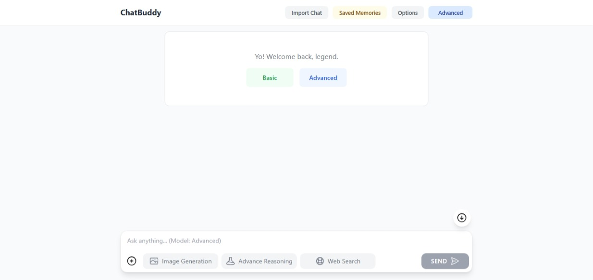

# 💬 ChatBuddy - Your Intelligent Conversational AI

[](https://opensource.org/licenses/MIT)
[](changelogs.md)

Welcome to ChatBuddy, a feature-rich web application that brings the power of advanced AI models to your browser, powered by the Gemini API.

### [](https://chatbuddy2026.onrender.com)



---
## ✨ Key Features

-   **💬 Multi-Chat Support**: Manage multiple conversations at once. Each chat is saved independently, allowing you to switch between different topics and contexts without losing your history.
-   **🖼️ Image Sharing**: Upload and discuss images directly in the chat.
-   **🎬 Video & Audio Sharing**: Share video and audio files with the Advanced Model.
-   **📂 File Sharing**: Share documents and text files (`PDF`, `TXT`, `DOCX`, etc.).
-   **🧠 Multiple Models**: Seamlessly switch between a fast, general-purpose model (*`gemma-3-27b-it`*) and advanced model for complex tasks, tools, and features (*`gemini-2.5-flash-lite`*).
-   **💭 Advanced Reasoning Mode**: A special mode for the Advanced model to tackle complex problems step-by-step.
-   **🤔 Model Thinking Transparency**: See the AI's reasoning process.
-   **🔎 Google Search & URL Context**: The advanced model can access web for up-to-date information.
-   **📝 Persistent State**: Your session is saved in `localStorage` and can be synced with Google Drive.
-   **🔄 Cross-Device Sync**: Sync your chat history and memories across multiple devices via Google Drive.
-   **🧠 Advanced Memory System**: A sophisticated memory system to maintain context and learn from conversations.
-   **🔧 Full Configurability**: Tailor the AI's behavior with custom instructions and your own API key.
-   **💻 Rich Markdown & Code Rendering**: Full GFM Markdown and LaTeX support.
-   **🛠️ Utility Features**: Export/import chats, memories, and full app data.
-   **📱 Responsive Design**: A clean, modern, and fully responsive UI.
-   **🌗 Auto Dark Mode**: The UI automatically adapts to your system's theme.
-   **🚄 Performance Friendly**: Enjoy a smooth and snappy UI with memoized components; for an even smoother experience, especially on lower-end devices, you can toggle off **Advanced Rendering** in the **Settings** menu.
-   **📊 In-App Daily Usage Tracker** *(Experimental)*: Track daily usage of each model in-app.

---

## 🛠️ Built With

-   [](https://reactjs.org/)
-   [](https://nodejs.org/)
-   [](https://expressjs.com/)
-   [](https://tailwindcss.com/)
-   [](https://ai.google.dev/)

<details>
<summary>⚙️ Technologies Used</summary>

-   **Frontend**:
    -   React
    -   Tailwind CSS
    -   Framer Motion for animations.
    -   `react-markdown` for rendering Markdown.
    -   `katex` for rendering LaTeX.
    -   `react-syntax-highlighter` for code highlighting.
-   **Backend**:
    -   Node.js with Express
    -   `@google/genai` SDK for AI models.
    -   `googleapis` for Google Drive sync.
    -   `express-fileupload` for file uploads.
    -   `pako` for data compression.
-   **Build Tools & Utilities**:
    -   `react-scripts`
    -   `nodemon`
    -   `dotenv`

</details>

---

## 🚀 Getting Started

To use ChatBuddy locally, you'll need to set up both the frontend and the backend. For self-hosting, a Google Cloud project with OAuth2 Consent Setup & Gemini API Key is required first.

### Prerequisites

-   Node.js (which includes npm)

### Frontend Setup

1.  **Clone the repository:**
    ```bash
    git clone https://github.com/KushalRoyChowdhury/ChatBuddy
    cd ChatBuddy/frontend
    ```

2.  **Install dependencies:**
    ```bash
    npm install
    ```

3.  **Run the development server:**
    ```bash
    npm start
    ```
    The application will be available at `http://localhost:3000`.

### Backend Setup

1.  **Navigate to the backend directory:**
    ```bash
    cd ../backend
    ```

2.  **Install dependencies:**
    ```bash
    npm install
    ```

3.  **Run the server:**
    ```bash
    npm start
    ```
    The backend server will start on port `8000`.

---

## 📂 Project Structure

For a detailed explanation of the project structure, please see the [Project Structure](ProjectStructure.md) file.

---

## 🤖 AI Models & API Keys

Powered by the official Google AI SDK (`@google/genai`).

### Public Version Limits

The hosted version's demo access has strict rate limits. It is **highly recommended** to use your own free Gemini API key for a better experience.
 
| FEATURE               | DEMO ACCESS                         | PERSONAL API KEY                  |
| --------------------- | ----------------------------------- | --------------------------------- |
| **Context Window**    | Basic: 4k / Advanced: 64k           | Basic: 8k / Advanced: 128k        |
| **Rate Limits (RPM)** | Basic: 5 / Advanced: 3              | Basic: 30 / Advanced: 15          |
| **Rate Limits (RPD)** | Basic: 1000 / Advanced: 100         | Basic: 14,400 / Advanced: 1000    |

*Context Sizes mentioned here uses server-side truncation*.

For details on data handling, please refer to the [Privacy Policy](PrivacyPolicy.md).

---

Official API RateLimits for free tier of model used in this project *(Updated as of: September 2025)*:

| MODEL (Free Tier)          | RPM    | RPD      | TPM      |
| -------------------------- | ------ | -------- | -------- |
| **gemma-3-12b-it**         | 30     | 14,400   | 15,000   |
| **gemma-3-27b-it**         | 30     | 14,400   | 15,000   |
| **gemini-2.5-flash-lite**  | 15     | 1,000    | 250,000  |

### How to get your Gemini API Key:

1.  Go to [Google AI Studio](https://aistudio.google.com).
2.  Click "Create API key".
3.  Paste the key into the "Gemini API Key" field in the ChatBuddy **Options** menu.

---

## 🛠️ How the Memory System Works

ChatBuddy uses a dual-model architecture. A helper model manages memory based on your conversation.

**Helper Model Actions**:
```json
{
  "action": "remember",
  "target": ["User's name is Alex."]
}
```
-   `"action"`: Can be `remember`, `forget`, `update`, or `temp`.
-   `"target"`: The information to act upon.

-   AI can also remember things based on context.
-   AI can reference recent conversations even in different chat sessions. To delete recent context delete the chat.

You can view and manage permanent memories from the `Saved Memories` modal.

> Memory is managed by model `gemma-3-12b-it`.

---

## 📜 Changelog

For a detailed list of changes, see the [Changelog](changelogs.md).

---

## 🤝 Contributing

This project is considered feature-complete, but contributions for stability and security are welcome. If you find a bug or have a suggestion for improvement, please open an issue or submit a pull request.

---

## 👥 Contributors

-   [KushalRoyChowdhury](https://github.com/KushalRoyChowdhury)

---

## 📧 Contact

[Kushal Roy Chowdhury](mailto:contact.kushalprojects@gmail.com)

---

## 📜 Source Code

The application source code is available on GitHub. If you find it useful, please consider giving it a star!

---

## 📜 License

This project is licensed under the MIT License. See the [LICENSE](LICENSE) file for details.

---

## ⚠️ Disclaimer

**Version 2.0 and above is not backward compatible with data from v1.X.** Due to significant data structure changes, older `.json` files & chats cannot be imported. Permanent Memories will be migrated automatically.

---

*Thank you for using ChatBuddy!*

---

*v2.4.0 - By [KushalRoyChowdhury](https://github.com/KushalRoyChowdhury)*
